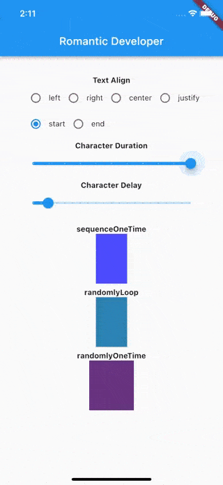

# Flutter Bouncing Text

A Flutter package to create a Romantic Bouncing Text. It will be useful for your awesome app.

More packages by [Romantic Developer](https://pub.dev/publishers/romanticdeveloper.com/packages)



### Example

```dart
import 'package:flutter/material.dart';
import 'package:flutter_bouncing_text/flutter_bouncing_text.dart';

void main() => runApp(MyApp());

class MyApp extends StatefulWidget {
  @override
  _MyAppState createState() => _MyAppState();
}

class _MyAppState extends State<MyApp> {
  @override
  Widget build(BuildContext context) {
    return MaterialApp(
      title: 'Example',
      theme: ThemeData(
        primarySwatch: Colors.blue,
      ),
      home: Home(),
    );
  }
}

class Home extends StatefulWidget {
  const Home({Key? key}) : super(key: key);

  @override
  State<Home> createState() => _HomeState();
}

class _HomeState extends State<Home> {
  
  @override
  Widget build(BuildContext context) {
    return Scaffold(
      appBar: AppBar(
        title: Text('Romantic Developer'),
      ),
      body: SafeArea(
        child: SingleChildScrollView(
          padding: const EdgeInsets.all(20.0),
          child: Column(
            crossAxisAlignment: CrossAxisAlignment.stretch,
            children: [
                AnimatedBouncingText(
                  text: 'I am\nRomantic Developer.',
                  mode: BouncingTextModes.sequenceOneTime,
                  textAlign: TextAlign.center,
                  characterDuration: const Duration(seconds: 1),
                  characterDelay: const Duration(milliseconds: 300),
                  textStyle: TextStyle(
                    color: Colors.white,
                    fontWeight: FontWeight.bold,
                    fontSize: 22,
                  ),
                  onEnd: () {
                    print('_HomeState.build.onEnd.$index');
                  },
                ),
            ],
          ),
        ),
      ),
    );
  }
}

```

### Development environment

```
[✓] Flutter (Channel stable, 3.0.5, on macOS 12.6 21G115 darwin-x64, locale en-VN)
    • Flutter version 3.0.5 at ~/fvm/versions/3.0.5
    • Upstream repository https://github.com/flutter/flutter.git
    • Framework revision f1875d570e (7 months ago), 2022-07-13 11:24:16 -0700
    • Engine revision e85ea0e79c
    • Dart version 2.17.6
    • DevTools version 2.12.2

[✓] Android toolchain - develop for Android devices (Android SDK version 33.0.0)
    • Android SDK at ~/Library/Android/sdk
    • Platform android-33, build-tools 33.0.0
    • ANDROID_HOME = ~/Library/Android/sdk
    • ANDROID_SDK_ROOT = ~/Library/Android/sdk
    • Java binary at: /Applications/Android Studio.app/Contents/jre/Contents/Home/bin/java
    • Java version OpenJDK Runtime Environment (build 11.0.12+0-b1504.28-7817840)
    • All Android licenses accepted.

[✓] Xcode - develop for iOS and macOS (Xcode 14.0)
    • Xcode at /Applications/Xcode_14.app/Contents/Developer
    • CocoaPods version 1.11.3

[✓] Chrome - develop for the web
    • Chrome at /Applications/Google Chrome.app/Contents/MacOS/Google Chrome

[✓] Android Studio (version 2021.2)
    • Android Studio at /Applications/Android Studio.app/Contents
    • Flutter plugin can be installed from:
      🔨 https://plugins.jetbrains.com/plugin/9212-flutter
    • Dart plugin can be installed from:
      🔨 https://plugins.jetbrains.com/plugin/6351-dart
    • Java version OpenJDK Runtime Environment (build 11.0.12+0-b1504.28-7817840)

[✓] VS Code (version 1.72.2)
    • VS Code at /Applications/Visual Studio Code.app/Contents
    • Flutter extension version 3.42.0

[✓] Connected device (3 available)
    • iPhone 11 (mobile) • 048D2DE1-4789-4F23-BA2F-A0EE3C1BD78C • ios            • com.apple.CoreSimulator.SimRuntime.iOS-16-0 (simulator)
    • macOS (desktop)    • macos                                • darwin-x64     • macOS 12.6 21G115 darwin-x64
    • Chrome (web)       • chrome                               • web-javascript • Google Chrome 109.0.5414.119

[✓] HTTP Host Availability
    • All required HTTP hosts are available

• No issues found!
```